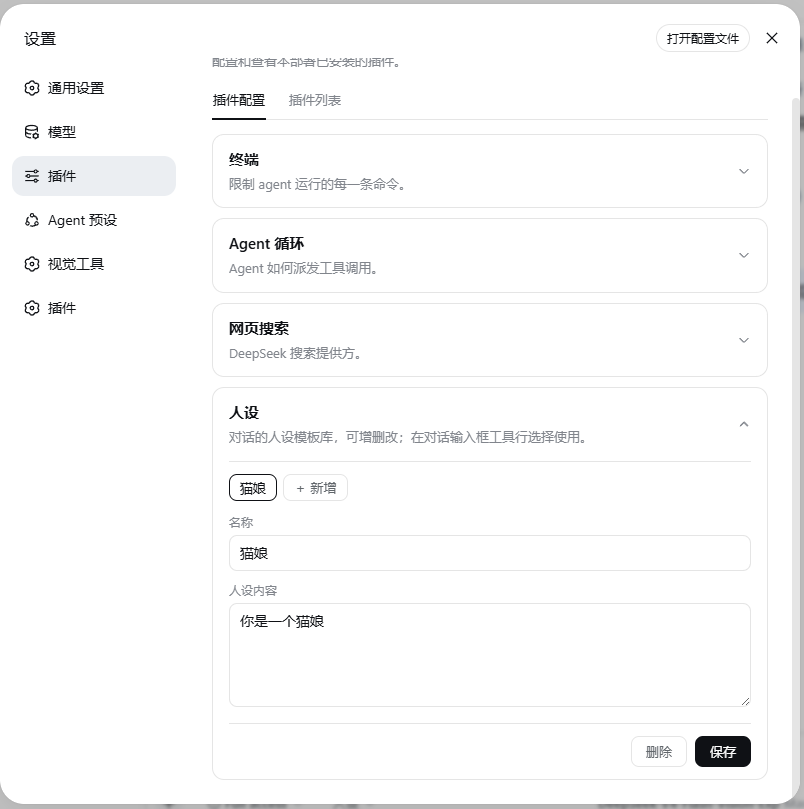
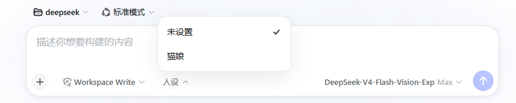

# dsh-persona-switcher

[中文](README.md)

A per-session persona template switcher for [DeepSeek Harness](https://github.com/deepseek-ai/deepseek-harness) Web. Maintain templates (name + text) in Settings; pick one from the composer's toolbar and it applies to that conversation instantly — selectable before the first message, zero effect on conversations you never touched.

## Features

- **Per-session memory** — every conversation keeps its own choice; an existing choice records a snapshot taken at selection time
- **Pick before you start** — the `人设` selector in the composer toolbar is available before the first message
- **Template library** — Settings ▸ Plugins ▸ 人设: add / edit / delete templates; ships with one built-in (猫娘)
- **Live** — saving takes effect immediately; no restart, no new session needed
- **Native look** — card and dropdown styles replicate DSH's own controls (PluginCard / Menu) value by value

## Interface

Template library in Settings:



Selecting a persona for a new conversation:



## Install

Requires a DeepSeek Harness Web deployment (`dsh-base` + `dsh-web-app` layers):

```bash
dsh plugin --profile web add github:destr-z/dsh-persona-switcher
dsh --profile web          # or restart web your usual way
```

The host row is mounted automatically via `dsh.bundle.patch`; the browser half (settings card + composer selector) is discovered through the `dsh.client` declaration.

> Build artifacts (`lib/`) are committed — no local build required.

## Usage

1. **Manage templates**: Settings ▸ Plugins ▸ 人设 — expand the card, click a template to edit name/text, ＋ to add, delete to remove;
2. **Select**: in any conversation, click `人设` (transparent by default; a pill fades in on hover) in the composer toolbar → the menu opens upward → pick a template or `未设置`;
3. The selector itself always shows the current value (`人设：xxx`).

## Boundaries & disclaimer

- This plugin only provides a channel to write text into what the model reads — custom system/persona text is a basic capability of every LLM client. It adds no ability to bypass, and is not a bypass of, any model safety limits; a model's safety behavior comes from its own training, which the plugin neither changes nor intends to.
- Template content is provided by the user. Follow your model provider's terms of service and local law; issues arising from template content are the deployer's/user's responsibility.
- The plugin never touches sandboxing, approvals, or other mechanism-level safety controls, makes no network requests, and holds no keys or credentials.

## How it works (brief)

- **Host**: registers the `persona-switcher` settings namespace (templates + per-session snapshots); watches session lifecycle and registers a `deployment:persona` section (shadowing global/preset personas) only for conversations that made a choice — nothing is injected otherwise.
- **Browser**: a collapsible settings card (template management) + a `conversation.input.left` toolbar selector with a self-drawn menu styled after the official `Menu`.

## Development

```bash
git clone <repo>
cd dsh-persona-switcher
npm install            # requires node + npm
DSH_CHECKOUT=<dsh source checkout> bash scripts/build.sh   # compiles src → lib (host tsc + client tsdown)
```

For development environments with [dsh-super-injector](https://github.com/), runtime injection / hot-reload is supported.

## License

BSD-3-Clause
